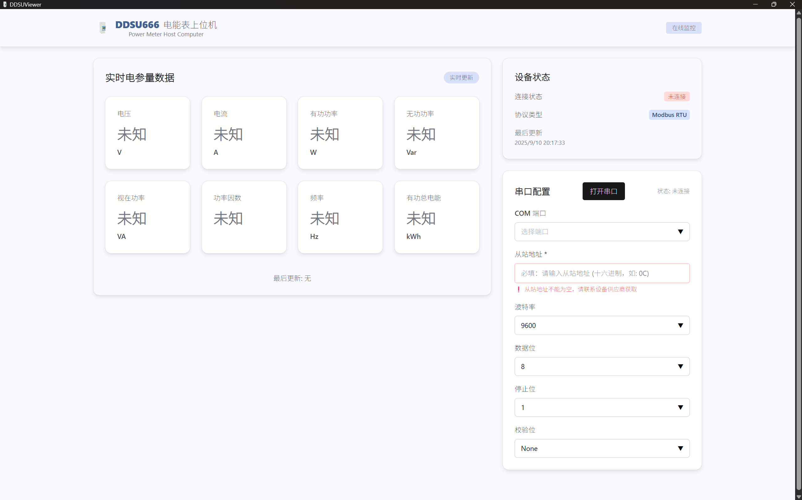

# DDSUViewer

DDSU666 单相电子式电能表上位机

DDSUViewer 是一个专为 DDSU666 单相电子式电能表设计的上位机软件，提供实时监控电参量数据的功能。该项目采用现代化的桌面应用开发技术栈，结合了 Go 语言的高性能后端处理能力和 React 的现代化前端界面

---

界面预览：



## 功能特性

- 实时监控电压、电流、功率、频率等电参量
- 支持 Modbus RTU 协议通信
- 自动检测 COM 端口
- 可配置串口参数和从站地址
- 现代化界面设计
- 数据轮询和状态监控

## 技术栈

- **后端**: Go 1.23 + Wails v2
- **前端**: React 18 + TypeScript + Chakra UI
- **串口通信**: go.bug.st/serial
- **构建工具**: Vite

## 快速开始

### 环境要求

- Go 1.23+
- Node.js 16+
- Windows 10/11 (64位)

### 安装步骤

```bash
# 克隆项目
git clone https://github.com/ChuwuYo/DDSUViewer.git
cd DDSUViewer

# 安装 Go 依赖
go mod tidy

# 安装前端依赖
cd frontend
npm install
cd ..

# 开发模式运行
wails dev
```

### 构建应用

#### 使用 Wails 命令构建

```bash
# 标准构建
wails build

# 带版本号构建
wails build -ldflags="-X main.Version=1.0.0"

# 压缩构建
wails build -ldflags="-s -w" -upx
```

#### 使用 PowerShell 构建脚本

项目根目录提供了两个 PowerShell 构建脚本：

1. [build.ps1](file:///E:/1Chuwu/Goprojects/DDSUViewer/build.ps1) - 标准构建脚本
2. [upxbuild.ps1](file:///E:/1Chuwu/Goprojects/DDSUViewer/upxbuild.ps1) - UPX压缩构建脚本

使用方法：

```powershell
# 使用特定版本号进行标准构建
.\build.ps1 -Version "1.0.0"

# 使用特定版本号进行UPX压缩构建（前提是您有安装upx）
.\upxbuild.ps1 -Version "1.0.0"
```

两个脚本都会自动：
1. 更新 [wails.json](file:///E:/1Chuwu/Goprojects/DDSUViewer/wails.json) 中的 productVersion
2. 更新 [frontend/package.json](file:///E:/1Chuwu/Goprojects/DDSUViewer/frontend/package.json) 中的 version
3. 执行 Wails 构建命令
4. 将版本号传递给应用程序

UPX压缩构建会进一步减小可执行文件大小，但需要系统上已安装 UPX 工具。

构建完成后，可执行文件位于 `build/bin/DDSUViewer.exe`

## 使用说明

1. 连接 DDSU666 电能表到 RS485 接口
2. 启动应用，选择 COM 端口
3. 设置从站地址（十六进制，如：0C）
4. 点击"打开串口"开始数据采集

### 串口配置参数

- **波特率**: 9600 (默认)
- **数据位**: 8 (默认)
- **停止位**: 1 (默认)
- **校验位**: None (默认)
- **从站地址**: 0C (默认，根据实际设备设置)

## 支持的寄存器

| 参数 | 地址 | 单位 | 描述 |
|------|------|------|------|
| 电压 | 0x2000 | V | 电网电压 |
| 电流 | 0x2002 | A | 负载电流 |
| 有功功率 | 0x2004 | W | 实际做功功率 |
| 无功功率 | 0x2006 | VAR | 无功功率 |
| 视在功率 | 0x2008 | VA | 总功率 |
| 功率因数 | 0x200A | - | 功率因数 |
| 频率 | 0x200E | Hz | 电网频率 |
| 有功总电能 | 0x4000 | kWh | 累计电能 |

## 项目结构

```
DDSUViewer/
├── docs/                  # 文档目录
│   ├── steering/          # 技术指导文档
│   └── *.pdf              # 设备说明书
├── frontend/              # 前端代码
│   ├── src/
│   │   ├── components/    # React 组件
│   │   ├── hooks/         # 自定义 Hooks
│   │   ├── store/         # 状态管理
│   │   └── theme/         # 主题配置
│   └── wailsjs/           # Wails 生成的绑定文件
├── internal/              # 后端内部包
│   ├── modbus/            # Modbus 协议实现
│   ├── serial/            # 串口通信
│   ├── registers/         # 寄存器定义和解析
│   ├── poller/            # 数据轮询器
│   ├── service/           # 业务服务层
│   ├── parser/            # 数据解析器
│   └── protocol_detector/ # 协议检测器
├── app.go                 # Wails 应用入口
├── main.go                # 程序主入口
├── wails.json             # Wails 配置文件
├── build.ps1              # PowerShell 标准构建脚本
├── upxbuild.ps1           # PowerShell UPX压缩构建脚本
└── go.mod                 # Go 模块定义
```

## 开发文档

详细的技术文档位于 [docs/steering/](docs/steering/) 目录：

- [01-项目概述.md](docs/steering/01-项目概述.md) - 项目整体介绍
- [03-Modbus协议实现.md](docs/steering/03-Modbus协议实现.md) - Modbus 协议实现细节
- [06-开发环境配置.md](docs/steering/06-开发环境配置.md) - 开发环境搭建指南
- [08-DDSU666字节序验证.md](docs/steering/08-DDSU666字节序验证.md) - 字节序验证报告

## 许可证

MIT License